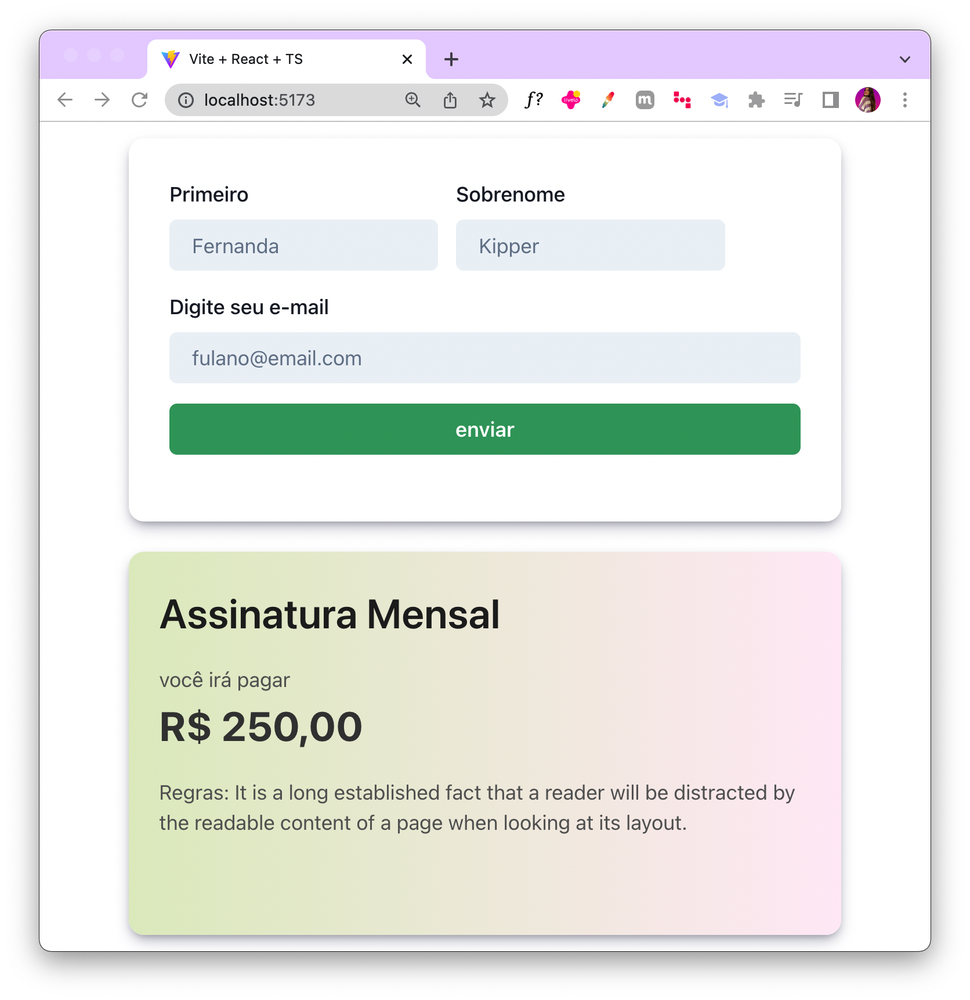

# Email Service Frontend


This repository contains a frontend project built using React JS and Chakra UI. This frontend project interacts with a Node.js API that enables the sending of registration confirmation emails to users, simulating a registration service or newsletter subscription.



## Features

- [x] User-friendly interface built with React JS and Chakra UI.
- [x] Integration with a Node.js API for sending registration emails.
- [x] Email validation and confirmation functionality.
- [x] Responsive design for seamless user experience on different devices.

## Prerequisites

To run this project locally, you need to have the following installed:

- Node.js
- npm (Node Package Manager)

## Getting Started

1. Clone the repository to your local machine

```bash
    git clone https://github.com/Fernanda-Kipper/membership-frontend
```

2. Navigate to the project's directory

```bash
    cd registration-service
```

3. Install the dependencies

```bash
npm install
```

4. Start the application

```bash 
npm run dev
```

This will launch the application in your default browser at `http://localhost:5173`

6. Start the Node.js API

- Clone the [API repository](https://github.com/guivahl/redis-dba).
- Follow the instructions in the API's README to start the server.

## Contributing

Contributions are welcome! If you find any issues or have suggestions, please open an issue or submit a pull request in this repository.

## License
This project is licensed under the [MIT License](./LICENSE).